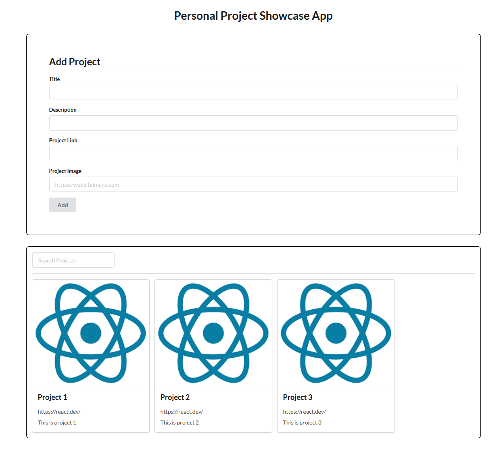

# React Portfolio SPA

A single-page application for showcasing personal projects. Built with React 19 and Vite, it lets you browse a project gallery, filter by name, and add new entries on the fly.

## Website Screenshot


## Features

- **Project gallery** — displays project cards with an image, title, description, and a clickable link that opens in a new tab
- **Live search** — filters the project list in real time as you type
- **Add projects** — submit the form to instantly add a new project card to the gallery without a page reload
- **Semantic UI styling** — clean, responsive layout using Semantic UI React components

## Setup

**Prerequisites:** Node.js 18+ and npm

```bash
# Clone the repo
git clone https://github.com/brad1379/react-portfolio-spa
cd react-portfolio-spa

# Install dependencies
npm install

# Start the dev server
npm run dev
```

Open [http://localhost:5173](http://localhost:5173) in your browser.

## Available Scripts

| Command | Description |
|---------|-------------|
| `npm run dev` | Start the Vite development server with hot reload |
| `npm run build` | Build optimised output to `dist/` |
| `npm run preview` | Preview the production build locally |
| `npm run lint` | Run ESLint across the source files |

## Usage

1. **Browse projects** — the gallery loads with seed data from [src/project_data.js](src/project_data.js)
2. **Search** — type in the search bar above the gallery to filter cards by project name
3. **Add a project** — fill in the "Add Project" form at the top (title, description, link, and an image URL) and click **Add**; the new card appears immediately

## Project Structure

```
src/
├── components/
│   ├── Filter.jsx        # Search input
│   ├── ProjectCard.jsx   # Individual project card
│   ├── ProjectList.jsx   # Gallery + filter logic
│   └── ProjectsForm.jsx  # Add-project form
├── project_data.js       # Seed project data
└── App.jsx               # Root component
```

## Known Limitations

- **No persistence** — added projects exist only in React state and are lost on page refresh; there is no backend or local storage integration
- **No form validation** — all fields are optional; submitting a blank form adds an empty card
- **Image URL only** — the image field accepts a URL string; local file uploads are not supported
- **Case-insensitive name search only** — filtering matches project names but not descriptions or links
- **Seed data uses placeholder content** — update `src/project_data.js` to replace the default entries with your own projects
